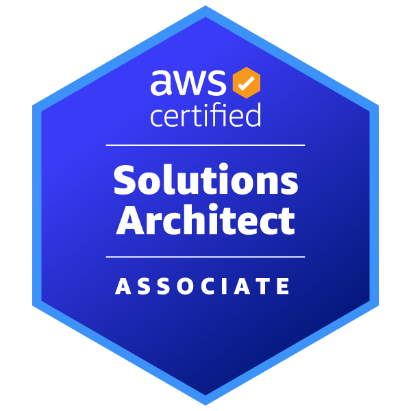

<!--
    Hey there, I'm Darshan Vijayaraghavan!
    Glad you stopped by to explore my GitHub profile.
    Feel free to explore my work and connect!
    
    If you find something helpful or interesting, give a follow :)
-->

 

    

### 🚀 About Me
I'm a passionate Full Stack Developer and Cloud Computing enthusiast with 3 years of industry experience. Currently pursuing my Master’s in Computer Science at the University of Colorado Boulder, I bring a strong foundation in system design, cloud infrastructure, and agile development.

My experience spans across frontend development, backend APIs, data visualization, DevOps, and cloud orchestration. I enjoy building scalable, resilient, and user-friendly applications.

---

### 💡 Key Skills

#### 💻 Programming Languages & Databases

#### 🧩 Full-Stack Tools & Frameworks

#### ☁️ DevOps & Cloud Platforms

---

### 📜 Certifications

<table>
  <tr>
    <td>
      <a href="https://www.credly.com/badges/2735a380-f711-470d-8283-5c21cc33e19c/public_url" target="_blank">
        🔗 <strong>AWS Certified Solutions Architect – Associate</strong> 
        <em>View Credential</em>
      </a>
    </td>
    <td>
      
    </td>
  </tr>
</table>

---

### 📑 Publications

#### 📰 **IEEE Publication**  
📄 [**A Novel Approach to Diagnose Osteoporosis Using Deep Learning Techniques**](https://ieeexplore.ieee.org/document/9752533)  
*IEEE Xplore, 2022*

Osteoporosis is a chronic degenerative disease affecting mostly postmenopausal women and individuals over 50. The paper presents an efficient method to predict osteoporosis risk using DEXA scan images. By applying preprocessing, data augmentation, SMOTE sampling, and training on various CNN/hybrid models, the proposed method achieves:
- **Accuracy**: 92.05%  

---

### 🔨 Featured Projects
- **Studious** – A study group platform using React, Node, Redis, GKE, and more.
- **VISION'21 Website** – National symposium platform with secure payments, used by 2000+ participants.

---

### 🌐 Let's Connect

  
  
  

---

### 📄 Resume
> [!IMPORTANT]  
> <a href="https://drive.google.com/file/d/1pCTttSVZ2_Rh0sf559Qi_0O7p-OmlgBF/view?usp=sharing" download>Click here to view my resume</a>

